## Thinkphp渗透方法

	TP5
	开启debug下的数据库连接
	tp5.0.*在debug模式下如果在数据交互点构造如sql注入、空参数等方式使数据库查询等出错，在一定情况下可能导致数据库账号密码直接显示出来。（报错信息太细了不仔细容易忽略掉）

	在debug模式下找注入点也可以通过报错语句进行构造，并且由于debug模式可能导致本来没有回显的注入变成报错注入。当然目标数据库无法外连的时候，这个注入就挺有用的了。

	关于log文件的利用
	log文件是runtime/log目录下的，比较常见的路径类似：
	/runtime/log/2020001/01.log ，默认是启用的，关于该文件主要有以下三点利用方式。
	1.关于http请求的部分
	常见的log文件会记录http请求，如果对应的站点存在后台等登陆，可以通过记录请求中的cookie登陆后台。
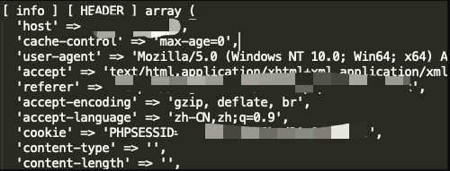

	2.关于构造sql注入
	某些配置下日志还会记录sql语句的执行和报错，可以用于构造sql注入，但是一般这种利用比较少，需要先找到数据交互点然后和日志中记录的赋值以及报错一一对应。
	3.关于cache文件名
	tp下通过缓存文件获取webshell是一个老生常谈的问题，白盒下理论上都说得通，但是实际上在使用该漏洞的时候是存在部分难点的，如生成cache文件的方式，cache文件名等。
	在log文件中可能存在cache文件生成时的报错，这样可以确定目标tp的cache文件命名方式等，举个例子：
	在某次渗透中目标tp的log文件。

	可以注意到这里由于生成缓存文件出错，导致直接将缓存文件的文件名输出。根据输出的缓存文件名去猜测生成规则，由于tp5的缓存文件命名默认是md5(value)，所以大部分时候可以把文件名等带进value进行比对。
	这里通过猜测和比对确定是view的文件绝对路径生成的cache文件名。

	一般来说使用php原生的md5函数去生成md5比较稳妥，笔者为了方便直接在线加密的。
	这里基本上就排除了cache getshell的一大难题。之后正常去寻找能进库的交互点，比如发帖，留言这种，就能想办法获取webshell了。
	tp5路由
	thinkphp系列的官方开发文档是期望网站运维人员将public设置为web根目录，即使用./public/index.php作为入口文件。在实际的渗透过程中由于thinkphp是框架涉及很多二次开发，部分开发人员会选择自定义一个入口文件而不置于public目录下，如/var/www/html/index.php的形式。这里会涉及到打exp的路由问题，由于部分开发人员自定的入口文件可能导致调用的路径出现差异。
	一般来说打exp的时候尽量使用./public/index.php来打，以下列exp为例：
	?s=index/\think\app/invokefunction&function=call_user_func_array&vars[0]=phpinfo&vars[1][]=1
	可能会出现例如：
	http://xxx/index.php?s=index/\think\app/invokefunction&function=call_user_func_array&vars[0]=phpinfo&vars[1][]=1
	http://xxx/public/index.php?s=index/\think\app/invokefunction&function=call_user_func_array&vars[0]=phpinfo&vars[1][]=1
	http://xxx/index.php?s=\think\app/invokefunction&function=call_user_func_array&vars[0]=phpinfo&vars[1][]=1
	所以很多时候不是打一个exp无效就代表没洞，在黑盒测试的时候可能只是没有找对路由。
	下面是实战中的案例：

	可以看到如果以常规的exp进行测试是返回方法不存在的，因为原生路由被二次开发修改了，所以最终代码执行的payload如下：

	5.0.*和5.1.*
	相对来说5.0可利用的exp比较5.1要多一些，5.1主要的利用方式还是上面举例用的exp。
	App.php出现问题的代码如下：
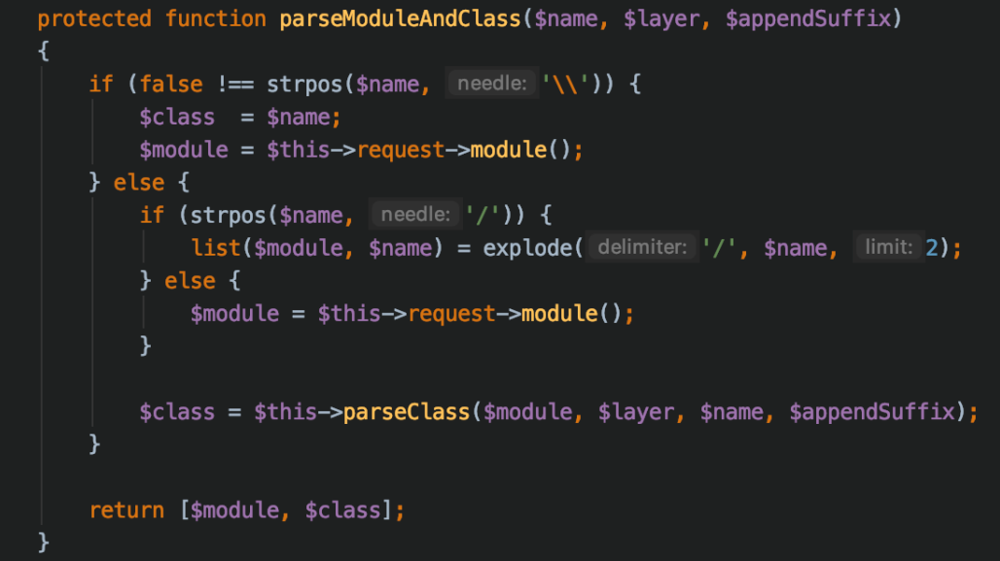

	其实就是把反斜杠认定为类名，最终使得类实例化，具体的分析在这里就不拿出来水字数了。
	而在渗透的过程中大的思路其实是差不多的，尝试多种exp，尝试读log文件等，可以通过简单比对两个版本的目录结构在没有其他信息的情况下判断版本。
	TP5：
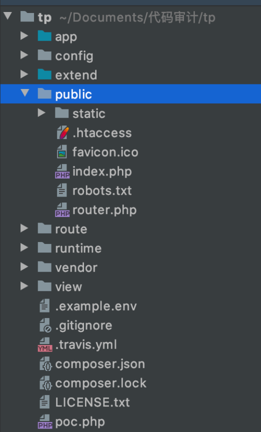

	TP5.1：
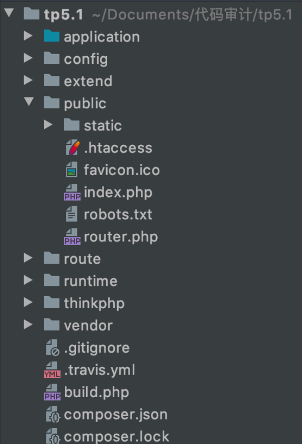

	如果网站不是以/public/作为根目录的话，又没通过报错直接体现版本的，可以通过访问目录看目录是否存在来做判断比如访问./thinkphp/，这里不推荐通过/app/目录来做判断，因为笔者遇到过很多开发者会修改这个目录，比方说改成/apps/，/applications/，也就无法准确判断是5.1还是5.0。
	tp3的渗透思路
	tp3 关于log文件相关的利用同上，目录一般为./Application/Runtime/logs/xxx/xx_xx_xx.log ，其中xxx为app名，文件名为年_月_日.log，如：
	Application\Runtime\Logs\Home\16_09_09.log。
	sql注入
	tp3的sql注入指的是框架层面的注入问题，即二次开发的时候如果调用了model内的find, delete, select方法的话，就可能出现注入问题。
	对于白盒测试而言，只要model.class.php没修复然后找到调用了方法的地方就可以挖掘到注入。
	以select方法简单做个分析。
	Model.class.php
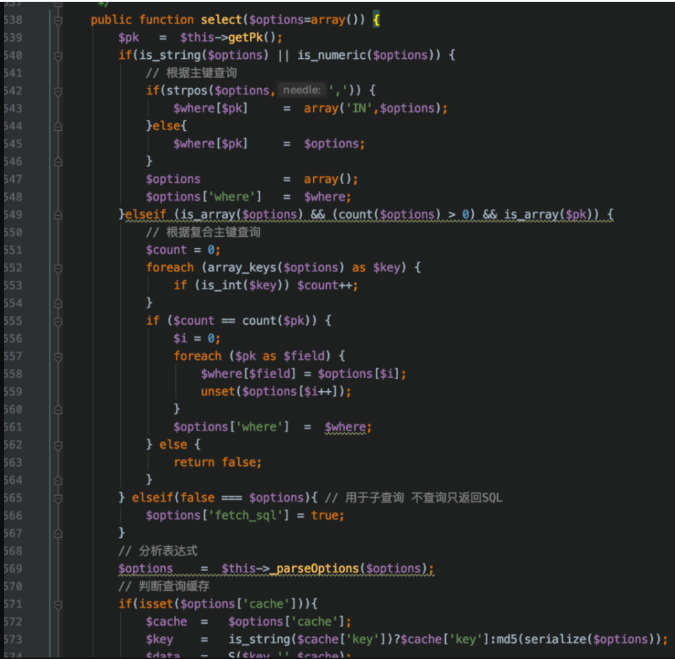

	函数可以接受一个options参数，为了构成注入肯定是要进入到_parseOptions方法，也就是要绕过两次判断，也就是只要传输的options为数组，同时主键不是数组，就能进到_parseOptions方法。
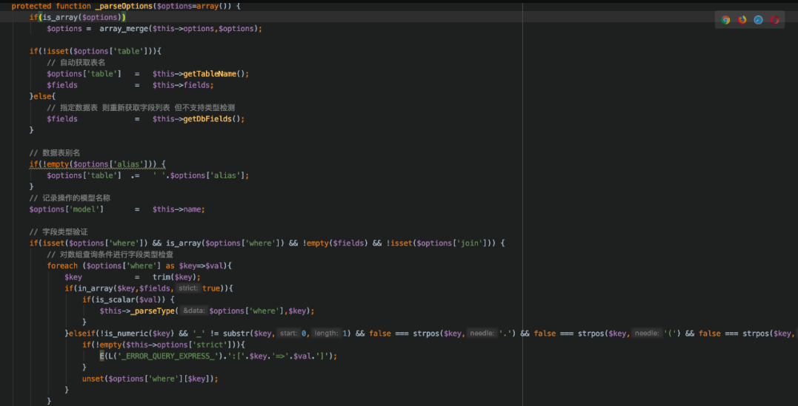

	可以看到传入options['table']或options['alias']且设置options['where']值为字符串，最终会options直接返回，整个过程是没有过滤的，然后进到ThinkPHP\Libray\Think\Db\Diver.class.php，进到select方法。
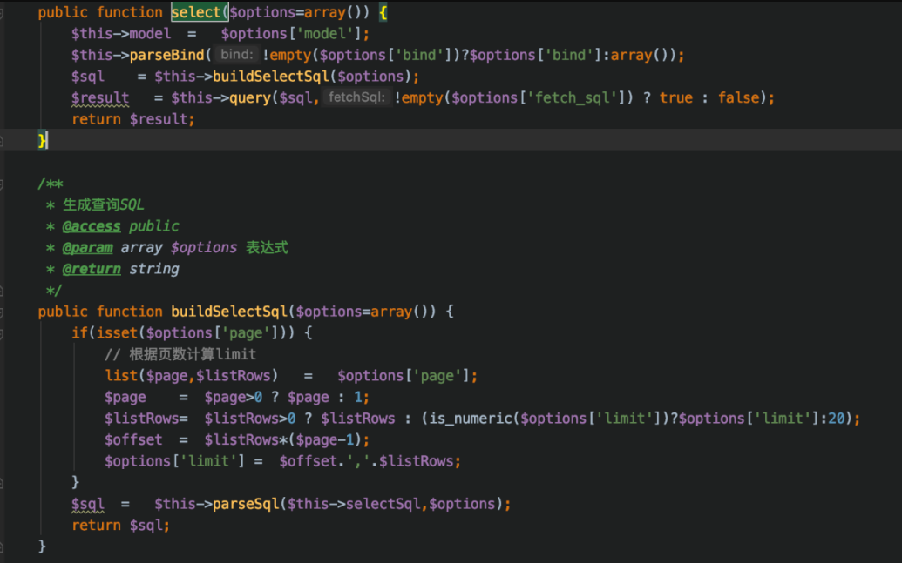

	可以看到sql语句是最后的parseSql生成的。
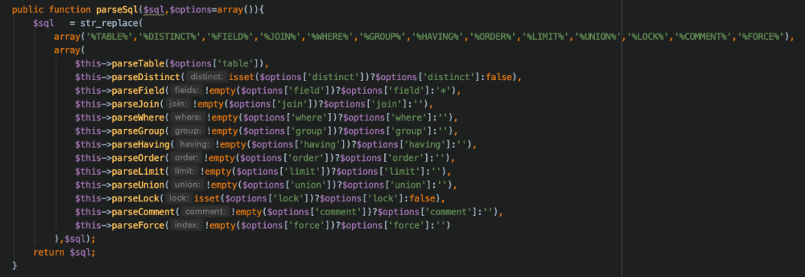

	跟进到parseWhere方法，只要绕过if，最终的return的sql语句是直接拼接的，也就是注入的产生原因，会直接带入select方法执行。

	黑盒测试也比较类似，一般情况下找到数据库交互点后进行注入尝试即可。
	cache写shell
	cache写webshell的难点在于cache文件名的确定，一般情况下是md5(绝对路径)生成的cache文件，上文也提到某些情况下可以通过log文件确定cache文件名称
	cache文件写入的时候会被注释，所以需要通过%0d%0a提行绕过注释。
	所以最终的payload一般为：
	
	%0d%0aeval($_POST['cmd']);%0d%0a//
	找到参数影响页面的点后通过传参写入webshell，本地可以复现，实战中倒是没遇到过。
	tp3渗透主要思路
	tp3的渗透在实战中利用的点比较少，所以一般而言遇到tp3的目标，最主要的思路在于找log，然后通过log去看有没有后台之类的，相对来说较一起会比对框架的注入，cache写shell等靠谱。
	tp3 关于log文件相关的利用同tp5，目录一般为./Application/Runtime/logs/xxx/xx_xx_xx.log ，其中xxx为app名，文件名为年_月_日.log，如：
	Application\Runtime\Logs\Home\16_09_09.log，文件名的格式可能会有变化，多尝试一下一般也能找到。
	tp6的新型问题
	tp6的利用链
	关于model.php的__destruct()方法调用其他类__tostring()方法的文已经有人发过了，但是文中把poc打码了，这里简单跟一下。

	将对象的lazySave属性设置为True进入save方法：
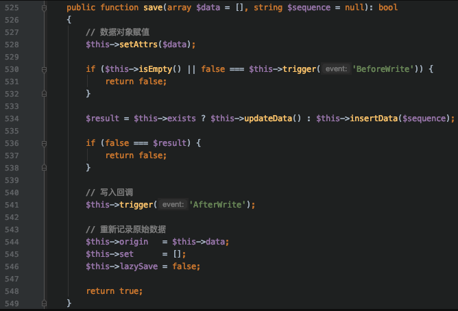

	然后进updateData方法：
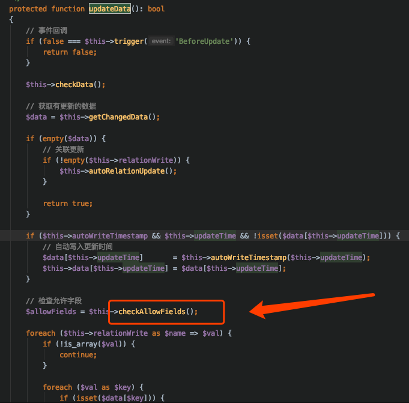

	在checkAllowFields方法中调用db方法，图中方法中框起来的语句是可以拼接的，只需要将这两个属性中的一个设置为类对象，即可触发对象的__toString方法。之后的利用方式和tp5.*相同。
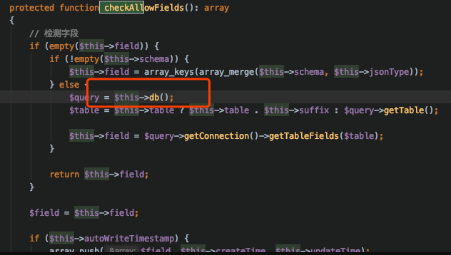
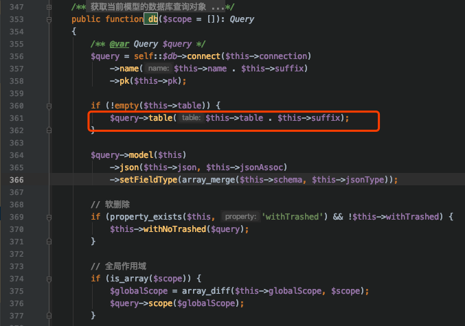

	接着与tp5.*后的gadget是一致的，最终目的是要这个效果实现代码执行。

	接下来是构造poc，由于测试利用链，笔者手写了一个unserialize。
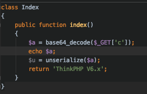

	然后通过Dido1960大佬的poc代码生成payload。
	poc参见：
	https://github.com/Dido1960/thinkphp/blob/master/v6.0.x/poc/poc.php
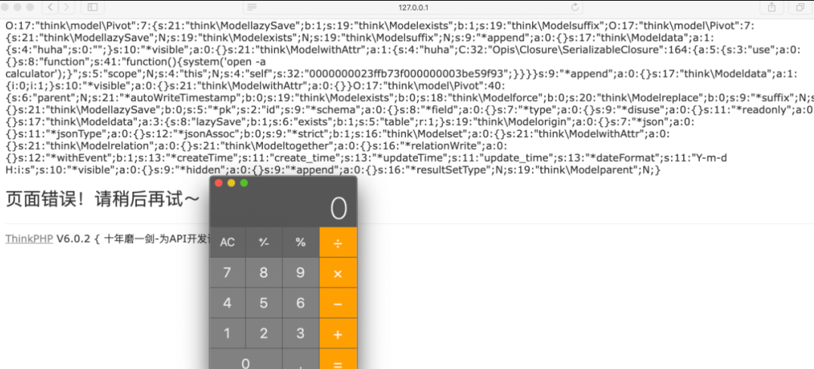
	

	该利用链需求一个反序列化的可控点，二次开发在使用unserialize后可能导致代码执行。同时也可能利用该问题构成一个tp6的后门，如已经通过其他方式获取服务器权限，则可在某些地方加入unserialize函数实现反序列化的一个后门。

###出处：

酒仙桥六号部队

